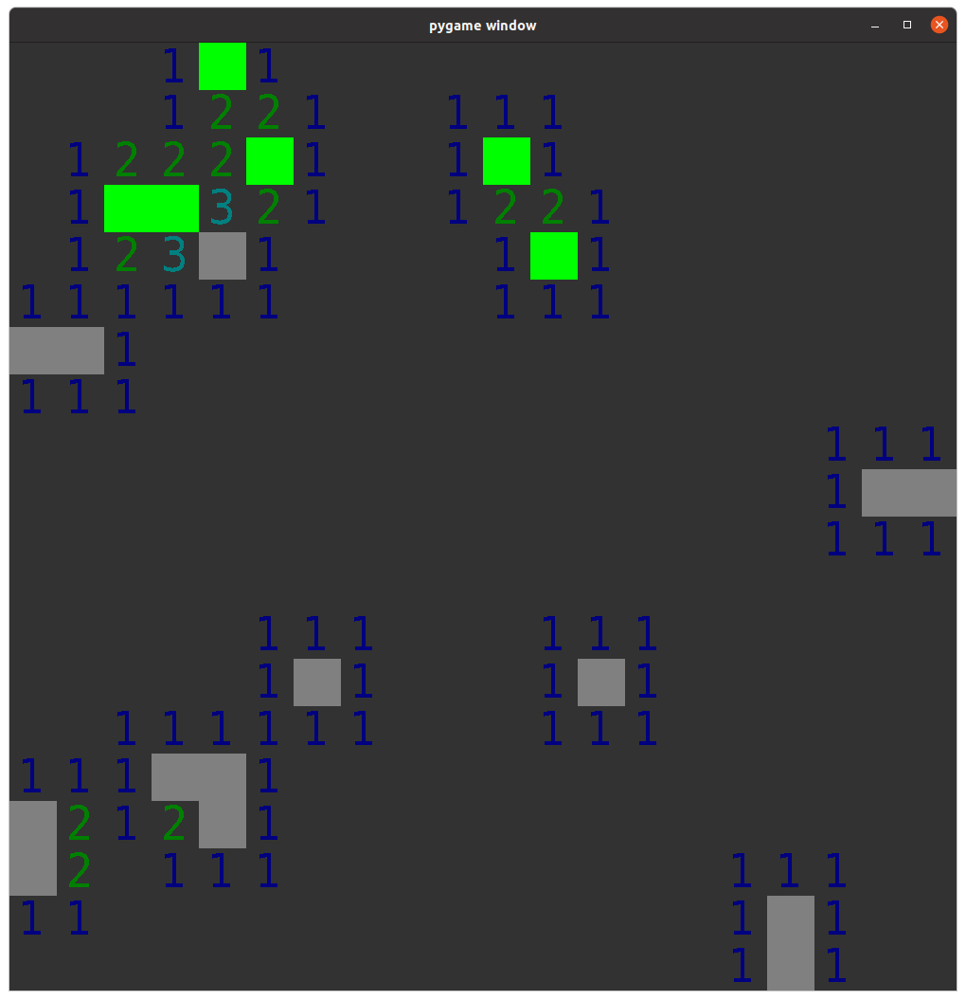

# MineSweeper

This is a quick project I put together in order to build an AI for minesweeper.  It's simple and limited, but that makes it a good toy.

## Install

    pip install -r requirements.txt

## Play

    python ms.py

The win/lose state of the game will be printed as the window closes.  This happens so the AI can play without any further interaction.

Buttons:

 * Left mouse button: click on a square
 * Right mouse button: flag a bomb (turns green)
 * any key: run the AI

## AI Algorithm
The AI works in a two-stage process:

 1. Account for all known squares deductively, infering the state of unknown squares that border them (deterministic solver);
 2. When all that can be known is known, compute a probability that each square is a bomb, and select the lowest scoring square (heuristic solver)

Though it's impossible to win _every_ game of minesweeper with a random board, this should be an optimal strategy if the probabilities computed in (2) are 'real'.  I suspect there's some room for improvement on this front.